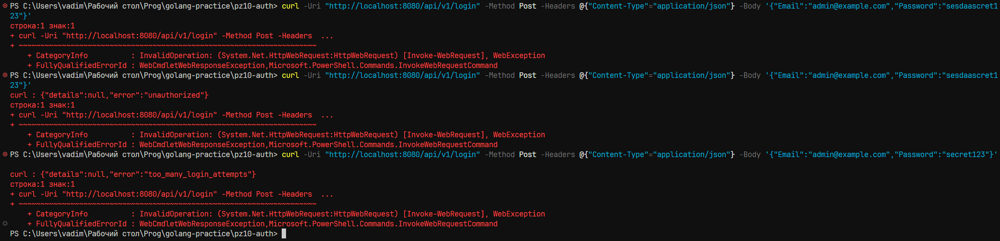
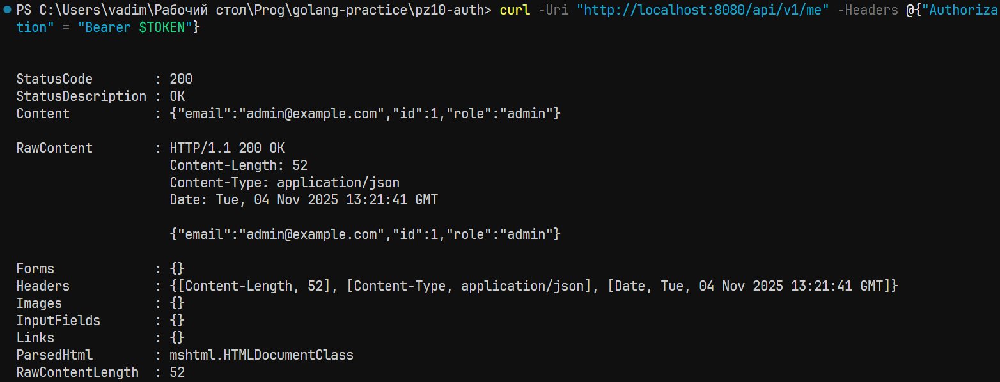
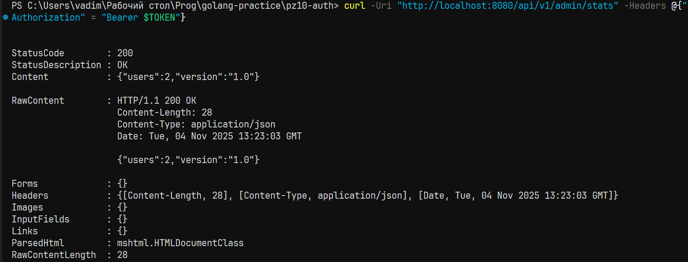
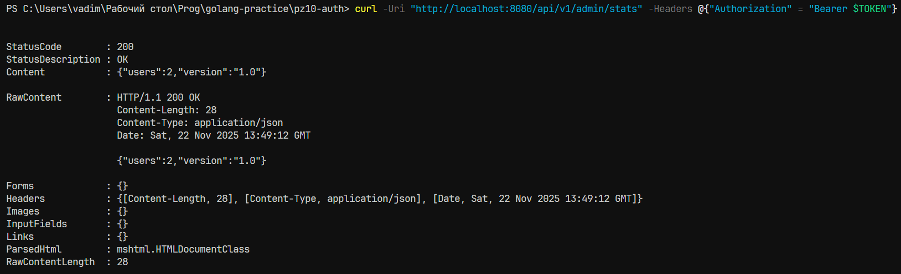
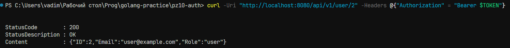

# Практическая работа № 10
Студент: Юркин В.И.

Группа: ПИМО-01-25

Тема: JWT-аутентификация: создание и проверка токенов. Middleware для авторизации


Цели:
- Понять устройство JWT и где его уместно применять в REST API. 
- Сгенерировать и проверить JWT в Go (HS256), передавать его в Authorization: Bearer
- Реализовать middleware-аутентификацию (достаёт токен, валидирует, кладёт клеймы в context). 
- Добавить middleware-авторизацию (RBAC/права на эндпоинты). 
- Встроить это в уже знакомую архитектуру HTTP-сервиса/роутера.


## Структура проекта

```
PZ10-AUTH
├── cmd
│   └── server
│       └── main.go           # Точка входа приложения
├── internal
│   ├── core                   # Основные доменные интерфейсы и контракты
│   │   ├── domains.go         # Описание доменных сущностей и структур данных
│   │   ├── repos.go           # Интерфейсы репозиториев
│   │   └── service.go         # Интерфейсы сервисов
│   ├── delivery              # Слой взаимодействия с приложением
│   │   ├── http							 # Работа с HTTP запросами
│   │   │   ├── handlers        # HTTP handlers
│   │   │   │   ├── auth_handler.go  # Обработчики для аунтефикации
│   │   │   │   └── user_handlers.go # Обработчики для работы с пользователями
│   │   │   └── middleware      # HTTP middleware
│   │   │       ├── authn.go     # Проверка аутентификации
│   │   │       ├── authz.go     # Проверка авторизации
│   │   │       ├── logger.go    # Логирование запросов
│   │   │       └── recover.go   # Обработка паник в HTTP
│   │   └── router.go           # Маршрутизация HTTP запросов
│   ├── repos                  # Реализации репозиториев
│   │   ├── session_redis_repo.go   # Репозиторий для хранения сессий в Redis
│   │   └── user_inmemory_repo.go   # Репозиторий пользователей в памяти
│   ├── services               # Реализация бизнес-логики
│   │   ├── auth_service.go     # Сервис аутентификации
│   │   └── user_service.go     # Сервис работы с пользователями
│   └── utils                  # Вспомогательные модули
│       ├── config
│       │   └── config.go      # Загрузка конфигурации из env/файлов
│       ├── http
│       │   └── http.go        # Общие HTTP-утилиты
│       └── jwt
│           └── jwt.go         # Работа с JWT (генерация, валидация)

```


## Скриншоты (Windows 11)

### 1. Аунтефикация (Админ)
```bash
curl -Uri "http://localhost:8080/api/v1/login" -Method Post -Headers @{"Content-Type"="application/json"} -Body '{"Email":"admin@example.com","Password":"secret123"}'
```
Результат:



### 2. Авторизация (Админ)
```bash
$TOKEN = "<скопируйте токен>"
```
```bash
curl -Uri "http://localhost:8080/api/v1/me" -Headers @{"Authorization" = "Bearer $TOKEN"}
```
```bash
curl -Uri "http://localhost:8080/api/v1/admin/stats" -Headers @{"Authorization" = "Bearer $TOKEN"}
```
Результат:






### 4. Авторизация
```bash
curl.exe -i -X POST http://localhost:8080/auth/login  -H "Content-Type: application/json"  -d '{\"email\":\"user@example.com\",\"password\":\"Secret123!\"}'
```
Результат:



### 5. Авторизация (с неверными данными)
```bash
curl -Method DELETE http://localhost:8080/api/v1/notes/6904e846613fbf31ddac61e5
```
Результат:




## Запуск

Docker: 25.0.3

Golang: 1.24.0

### Конфигурация
.env
```
# Порт, на котором запускается приложение
APP_PORT=8080

# Ключи для подписи и проверки подлинности JWT токенов
PUBLIC_RSA=""
PRIVATE_RSA=""

# Время жизни access token
ACCESS_TTL=15m

# Время жизни refresh token
REFRESH_TTL=168h

# Настройки redis 
REDIS_HOST=localhost
REDIS_PORT=6379
REDIS_PASSWORD=your_redis_password
REDIS_DB=0

```

### Локально
1. Создание .env файла (см. .env.example)
2. Развёртывание БД (Redis)
```bash
docker-compose -f docker-compose.dev.yml up -d
```
3. Установка зависимостей
```bash
make install
```
4. Запуск сервера
```bash
make run
```

### На сервере
1. Создание .env файла (см. .env.example)
2. Развёртывание сервера
```bash
docker-compose up --build -d
```


